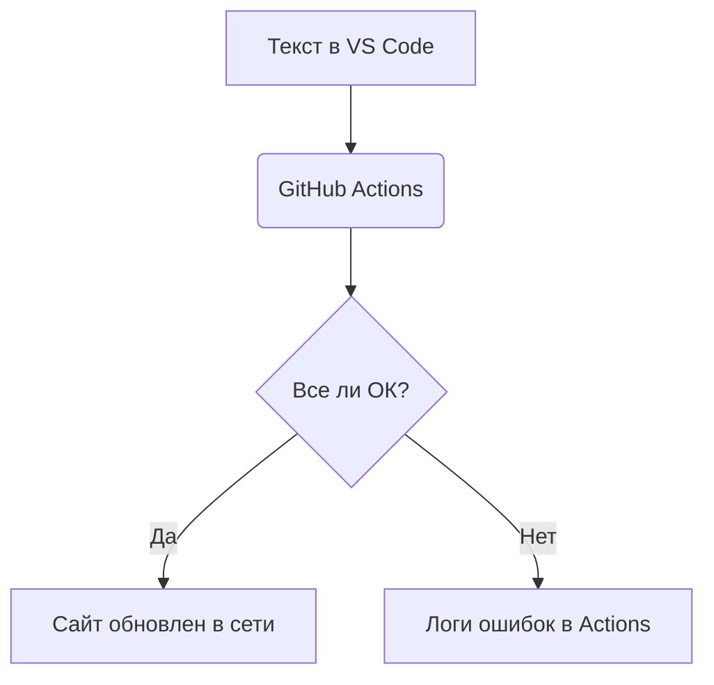

# Руководство пользователя

На этой странице мы можем описать любую инструкцию.

### Полезные фичи Markdown:
* Это ненумерованный список
* *Курсивный текст*
* **Жирный текст**

### Схема нашего процесса Docs as Code

